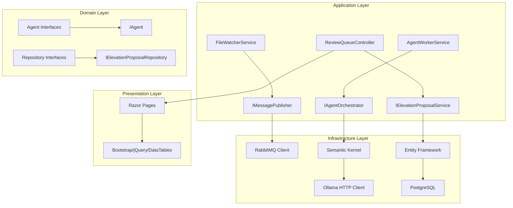

# Components

### FileWatcherService

**Responsibility:** Monitors the raw Obsidian vault directory for new markdown files and publishes processing messages to RabbitMQ queue

**Key Interfaces:**
- IFileWatcherService: Defines start/stop monitoring operations
- IMessagePublisher: Abstracts RabbitMQ message publishing
- IFileValidator: Validates markdown files before processing

**Dependencies:** 
- FileSystemWatcher (.NET built-in) for file system monitoring
- RabbitMQ client for message publishing
- Configuration service for vault path and file patterns
- Logging service for audit trail

**Technology Stack:** .NET 8 BackgroundService, FileSystemWatcher, RabbitMQ.Client

### AgentWorkerService

**Responsibility:** Consumes file processing messages from RabbitMQ and orchestrates agent execution through Microsoft Semantic Kernel framework

**Key Interfaces:**
- IAgentOrchestrator: Manages agent loading and execution
- IMessageConsumer: Handles RabbitMQ message consumption
- ISemanticKernelService: Abstracts Semantic Kernel operations
- IOllamaConnector: Manages communication with Ollama API

**Dependencies:**
- Microsoft Semantic Kernel for agent framework
- HttpClient for Ollama API communication (localhost:11434)
- Entity Framework for database operations
- AgentConfiguration repository for loading agent settings

**Technology Stack:** .NET 8 BackgroundService, Microsoft Semantic Kernel, Entity Framework Core, RabbitMQ.Client

### ReviewQueueController

**Responsibility:** Extends existing OptimalUpchuck.UI with ASP.NET Core MVC controller for elevation proposal management

**Key Interfaces:**
- IElevationProposalService: Business logic for proposal operations
- IReviewQueueViewModel: Data transfer objects for UI binding
- IContentFormatter: Formats content for rich text editing

**Dependencies:**
- Entity Framework repositories for proposal data access
- Summernote integration for markdown editing
- DataTables for filtering and sorting
- Bootstrap toast for user confirmations

**Technology Stack:** ASP.NET Core MVC, Razor Pages, Bootstrap, jQuery, Summernote, DataTables

### ElevationProposalRepository

**Responsibility:** Data access layer for elevation proposals with advanced querying capabilities

**Key Interfaces:**
- IElevationProposalRepository: CRUD operations and complex queries
- IQueryableExtensions: Agent type filtering and status-based queries

**Dependencies:**
- Entity Framework Core DbContext
- PostgreSQL database connection
- FluentValidation for data validation

**Technology Stack:** Entity Framework Core, PostgreSQL, FluentValidation

### AgentFactory

**Responsibility:** Instantiates and configures specialized agents based on AgentConfiguration settings

**Key Interfaces:**
- IAgentFactory: Creates agents by type with configuration
- IAgent: Base interface for all agent implementations
- IAgentConfigurationService: Loads and validates agent settings

**Dependencies:**
- Microsoft Semantic Kernel for agent instantiation
- Configuration repository for agent settings
- Ollama HTTP connector for AI model communication

**Technology Stack:** Microsoft Semantic Kernel, Dependency Injection, HttpClient

### Component Diagrams


