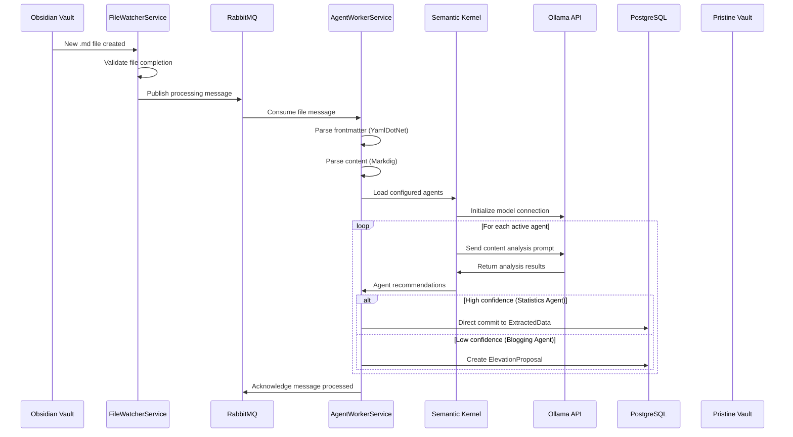
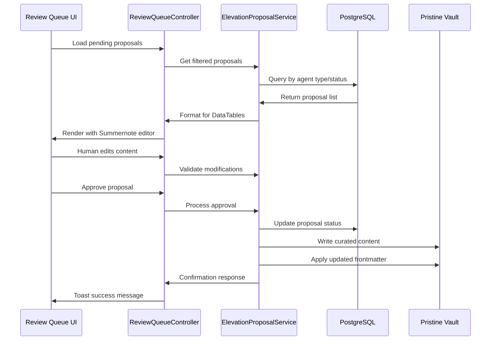

# Core Workflows

### File Processing Workflow

```mermaid
sequenceDiagram
    participant OV as Obsidian Vault
    participant FW as FileWatcherService
    participant RMQ as RabbitMQ
    participant AWS as AgentWorkerService
    participant SK as Semantic Kernel
    participant OA as Ollama API
    participant DB as PostgreSQL
    participant PV as Pristine Vault

    OV->>FW: New .md file created
    FW->>FW: Validate file completion
    FW->>RMQ: Publish processing message
    RMQ->>AWS: Consume file message
    AWS->>AWS: Parse frontmatter (YamlDotNet)
    AWS->>AWS: Parse content (Markdig)
    AWS->>SK: Load configured agents
    SK->>OA: Initialize model connection
    
    loop For each active agent
        SK->>OA: Send content analysis prompt
        OA->>SK: Return analysis results
        SK->>AWS: Agent recommendations
        
        alt High confidence (Statistics Agent)
            AWS->>DB: Direct commit to ExtractedData
        else Low confidence (Blogging Agent)
            AWS->>DB: Create ElevationProposal
        end
    end
    
    AWS->>RMQ: Acknowledge message processed
```

### Review Queue Workflow

```mermaid
sequenceDiagram
    participant RQ as Review Queue UI
    participant RC as ReviewQueueController
    participant EP as ElevationProposalService
    participant DB as PostgreSQL
    participant PV as Pristine Vault

    RQ->>RC: Load pending proposals
    RC->>EP: Get filtered proposals
    EP->>DB: Query by agent type/status
    DB->>EP: Return proposal list
    EP->>RC: Format for DataTables
    RC->>RQ: Render with Summernote editor
    
    RQ->>RC: Human edits content
    RC->>EP: Validate modifications
    RQ->>RC: Approve proposal
    RC->>EP: Process approval
    EP->>DB: Update proposal status
    EP->>PV: Write curated content
    EP->>PV: Apply updated frontmatter
    EP->>RC: Confirmation response
    RC->>RQ: Toast success message
```

