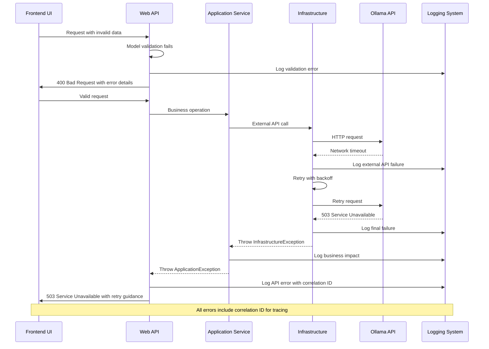

# Error Handling Strategy

### General Approach

- **Error Model:** Structured exception hierarchy with domain-specific error types and standardized error responses
- **Exception Hierarchy:** Base `OptimalUpchuckException` with specialized exceptions for domain (`DomainException`), application (`ApplicationException`), and infrastructure (`InfrastructureException`) layers
- **Error Propagation:** Exceptions bubble up through clean architecture layers with appropriate transformation at API boundaries

### Logging Standards

- **Library:** Serilog 3.1.1 with structured logging and multiple sinks
- **Format:** JSON structured logs with correlation IDs, service context, and performance metrics
- **Levels:** Trace (development), Debug (troubleshooting), Information (normal flow), Warning (recoverable issues), Error (exceptions), Fatal (application crashes)
- **Required Context:**
  - Correlation ID: GUID format for request tracing across services
  - Service Context: Service name, version, environment, and host information
  - User Context: Anonymous user tracking for audit purposes (no PII)

### Error Handling Patterns

#### External API Errors

- **Retry Policy:** Exponential backoff with jitter (1s, 2s, 4s, 8s) for Ollama API calls
- **Circuit Breaker:** Open circuit after 5 consecutive failures, half-open after 30 seconds
- **Timeout Configuration:** 30-second timeout for model inference, 5-second timeout for health checks
- **Error Translation:** Map Ollama HTTP errors to domain exceptions with user-friendly messages

**Ollama Service Unavailability Handling:**

1. **Service Detection:**
   - Request level monitoring.  If http response code indicates a problem, input will be retried later.   

4. **Recovery Procedures:**
   - Failed item retry with exponential backoff
   - Administrator notification of outage, recovery and queue status

#### Business Logic Errors

- **Custom Exceptions:** `InvalidProposalException`, `AgentProcessingException`, `ConfigurationException`
- **User-Facing Errors:** Standardized error messages with error codes for internationalization
- **Error Codes:** Hierarchical system (AGENT_001, PROPOSAL_002, CONFIG_003) for support tracking

#### Data Consistency

- **Transaction Strategy:** Unit of Work pattern with Entity Framework transaction scopes
- **Compensation Logic:** Saga pattern for multi-step operations (file processing → agent analysis → database commit)
- **Idempotency:** Message processing uses idempotency keys to prevent duplicate processing

### Error Flow



### Error Response Format

```typescript
interface ApiError {
  error: {
    code: string;
    message: string;
    details?: Record<string, any>;
    timestamp: string;
    requestId: string;
    retryAfter?: number;
  };
}
```

### Frontend Error Handling

```javascript
// Global error handler for AJAX requests
$(document).ajaxError(function(event, xhr, settings, thrownError) {
    const correlationId = xhr.getResponseHeader('X-Correlation-ID') || 'unknown';
    
    let errorMessage = 'An unexpected error occurred';
    let canRetry = false;
    
    if (xhr.responseJSON && xhr.responseJSON.error) {
        const error = xhr.responseJSON.error;
        errorMessage = error.message;
        canRetry = error.retryAfter !== undefined;
        
        // Log error for diagnostics
        console.error('API Error:', {
            code: error.code,
            message: error.message,
            correlationId: correlationId,
            url: settings.url,
            timestamp: error.timestamp
        });
    }
    
    // Show user-friendly error with Bootstrap Toast
    
});

// Specific error handling for review queue operations
class ReviewQueueErrorHandler {
    static handleProposalError(error, proposalId) {
        switch (error.code) {
            case 'PROPOSAL_NOT_FOUND':
                this.showError('Proposal no longer exists. The page will refresh.', () => {
                    location.reload();
                });
                break;
            case 'PROPOSAL_ALREADY_PROCESSED':
                this.showWarning('This proposal has already been processed by another user.');
                break;
            case 'AGENT_PROCESSING_FAILED':
                this.showError('Content processing failed. Please try again or contact support.');
                break;
            default:
                this.showError('An unexpected error occurred while processing the proposal.');
        }
    }
    
    static showError(message, callback) {
        Swal.fire({
            title: 'Error',
            text: message,
            icon: 'error',
            confirmButtonText: 'OK'
        }).then(callback);
    }
    
    static showWarning(message) {
        Swal.fire({
            title: 'Warning',
            text: message,
            icon: 'warning',
            confirmButtonText: 'OK'
        });
    }
}
```

### Backend Error Handling

```csharp
// Global exception middleware
public class GlobalExceptionMiddleware
{
    private readonly RequestDelegate _next;
    private readonly ILogger<GlobalExceptionMiddleware> _logger;

    public GlobalExceptionMiddleware(RequestDelegate next, ILogger<GlobalExceptionMiddleware> logger)
    {
        _next = next;
        _logger = logger;
    }

    public async Task InvokeAsync(HttpContext context)
    {
        try
        {
            await _next(context);
        }
        catch (Exception ex)
        {
            var correlationId = context.TraceIdentifier;
            _logger.LogError(ex, "Unhandled exception occurred. CorrelationId: {CorrelationId}", correlationId);
            
            await HandleExceptionAsync(context, ex, correlationId);
        }
    }

    private static async Task HandleExceptionAsync(HttpContext context, Exception exception, string correlationId)
    {
        var response = context.Response;
        response.ContentType = "application/json";
        response.Headers.Add("X-Correlation-ID", correlationId);

        var errorResponse = exception switch
        {
            ValidationException validationEx => new ApiErrorResponse
            {
                Error = new ErrorDetails
                {
                    Code = "VALIDATION_FAILED",
                    Message = "Invalid input provided",
                    Details = validationEx.Errors,
                    Timestamp = DateTime.UtcNow,
                    RequestId = correlationId
                }
            },
            
            AgentProcessingException agentEx => new ApiErrorResponse
            {
                Error = new ErrorDetails
                {
                    Code = "AGENT_PROCESSING_FAILED",
                    Message = "Content processing failed",
                    Details = new { AgentType = agentEx.AgentType, Reason = agentEx.Message },
                    Timestamp = DateTime.UtcNow,
                    RequestId = correlationId,
                    RetryAfter = 5 // seconds
                }
            },
            
            InvalidProposalException proposalEx => new ApiErrorResponse
            {
                Error = new ErrorDetails
                {
                    Code = "PROPOSAL_INVALID",
                    Message = proposalEx.Message,
                    Timestamp = DateTime.UtcNow,
                    RequestId = correlationId
                }
            },
            
            HttpRequestException httpEx when httpEx.Message.Contains("Ollama") => new ApiErrorResponse
            {
                Error = new ErrorDetails
                {
                    Code = "EXTERNAL_SERVICE_UNAVAILABLE",
                    Message = "AI processing service is temporarily unavailable. Files will be queued for processing when service resumes.",
                    Timestamp = DateTime.UtcNow,
                    RequestId = correlationId,
                    RetryAfter = 30,
                    Details = new { FallbackMode = "queue", EstimatedRecovery = "Monitoring service status" }
                }
            },
            
            OllamaServiceUnavailableException ollamaEx => new ApiErrorResponse
            {
                Error = new ErrorDetails
                {
                    Code = "AI_SERVICE_OFFLINE",
                    Message = ollamaEx.FallbackMode switch
                    {
                        "queue" => "AI service offline. Files queued for processing when service resumes.",
                        "manual" => "AI service offline. Content will require manual review.",
                        "degraded" => "AI service offline. Operating in limited processing mode.",
                        _ => "AI service offline. Please try again later."
                    },
                    Timestamp = DateTime.UtcNow,
                    RequestId = correlationId,
                    RetryAfter = ollamaEx.EstimatedRecoverySeconds,
                    Details = new { FallbackMode = ollamaEx.FallbackMode, QueuedItems = ollamaEx.QueuedItemCount }
                }
            },
            
            _ => new ApiErrorResponse
            {
                Error = new ErrorDetails
                {
                    Code = "INTERNAL_SERVER_ERROR",
                    Message = "An unexpected error occurred",
                    Timestamp = DateTime.UtcNow,
                    RequestId = correlationId
                }
            }
        };

        response.StatusCode = GetStatusCode(exception);
        
        var jsonResponse = JsonSerializer.Serialize(errorResponse, new JsonSerializerOptions
        {
            PropertyNamingPolicy = JsonNamingPolicy.CamelCase
        });
        
        await response.WriteAsync(jsonResponse);
    }

    private static int GetStatusCode(Exception exception) => exception switch
    {
        ValidationException => 400,
        InvalidProposalException => 400,
        KeyNotFoundException => 404,
        UnauthorizedAccessException => 401,
        AgentProcessingException => 503,
        HttpRequestException => 503,
        _ => 500
    };
}

// Agent-specific error handling
public class SemanticKernelService
{
    private readonly ILogger<SemanticKernelService> _logger;
    private readonly HttpClient _httpClient;

    public async Task<AgentResult> ProcessContentAsync(string content, AgentConfiguration config)
    {
        var correlationId = Guid.NewGuid().ToString();
        
        try
        {
            _logger.LogInformation("Starting agent processing. Agent: {AgentType}, CorrelationId: {CorrelationId}", 
                config.AgentType, correlationId);

            // Implement circuit breaker pattern
            var result = await Policy
                .Handle<HttpRequestException>()
                .Or<TaskCanceledException>()
                .WaitAndRetryAsync(
                    retryCount: 3,
                    sleepDurationProvider: retryAttempt => TimeSpan.FromSeconds(Math.Pow(2, retryAttempt)),
                    onRetry: (outcome, timespan, retryCount, context) =>
                    {
                        _logger.LogWarning("Retry attempt {RetryCount} for agent {AgentType}. CorrelationId: {CorrelationId}",
                            retryCount, config.AgentType, correlationId);
                    })
                .ExecuteAsync(async () =>
                {
                    return await CallOllamaApiAsync(content, config, correlationId);
                });

            _logger.LogInformation("Agent processing completed successfully. Agent: {AgentType}, CorrelationId: {CorrelationId}", 
                config.AgentType, correlationId);

            return result;
        }
        catch (Exception ex)
        {
            _logger.LogError(ex, "Agent processing failed. Agent: {AgentType}, CorrelationId: {CorrelationId}", 
                config.AgentType, correlationId);
            
            throw new AgentProcessingException(config.AgentType, 
                $"Failed to process content with {config.AgentType}", ex);
        }
    }
}
```
