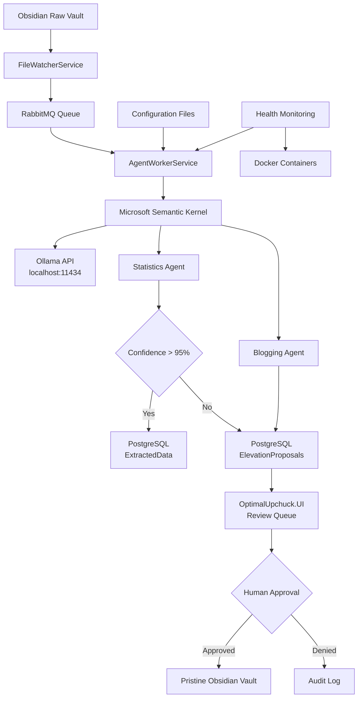

# High Level Architecture

### Technical Summary

The Optimal Upchuck system implements a microservices architecture within a monorepo, following clean architecture principles with clear separation between Domain, Application, Infrastructure, and Presentation layers. The system leverages Microsoft Semantic Kernel for AI agent orchestration, communicating with a local Ollama inference server for content analysis. A file watcher service monitors Obsidian vault changes, publishing processing requests to RabbitMQ queues consumed by worker services that execute specialized agents. High-confidence autonomous agents commit directly to PostgreSQL, while low-confidence proposals flow through a human review queue implemented via ASP.NET Core Razor Pages extending the existing UI framework.

### High Level Overview

The system follows a **microservices architecture** within a **monorepo** structure, implementing **clean architecture** principles for maintainability and testability. The **repository structure** supports multiple focused services while maintaining code sharing through common libraries.

**Service architecture** employs specialized worker services:
- FileWatcherService monitors Obsidian vault changes
- AgentWorkerService processes files through AI agents
- WebService extends existing UI for review queue functionality

**Primary data flow**: New markdown files trigger file detection → RabbitMQ message → agent processing → either autonomous database commit (Statistics Agent) or human review queue (Blogging Agent) → final output to pristine vault.

**Key architectural decisions**:
- Clean architecture enables testing and maintainability at scale
- Microsoft Semantic Kernel provides AI model abstraction and agent framework
- RabbitMQ ensures reliable async processing with error handling
- Existing UI extension minimizes disruption while adding functionality

### High Level Project Diagram

### Architectural Patterns

- **Clean Architecture**: Domain-centric design with dependency inversion, enabling testability and maintainability across multiple services - *Rationale:* Supports complex business logic around agent processing while maintaining clear boundaries for future agent expansion

- **Microservices within Monorepo**: Separate services for file watching, agent processing, and web UI while sharing common domain models - *Rationale:* Balances service isolation with code reuse, simplifying deployment while enabling independent scaling

- **Agent Pattern with Semantic Kernel**: Pluggable agent architecture using Microsoft Semantic Kernel for AI model abstraction - *Rationale:* Enables easy addition of new agents while maintaining consistent interfaces and model management

- **Event-Driven Processing**: File changes trigger async processing through RabbitMQ messaging - *Rationale:* Decouples file detection from processing, enabling reliable handling of processing failures and queue management

- **Repository Pattern**: Abstract data access for elevation proposals and extracted data - *Rationale:* Enables comprehensive testing and potential future database migrations while maintaining clean domain boundaries

